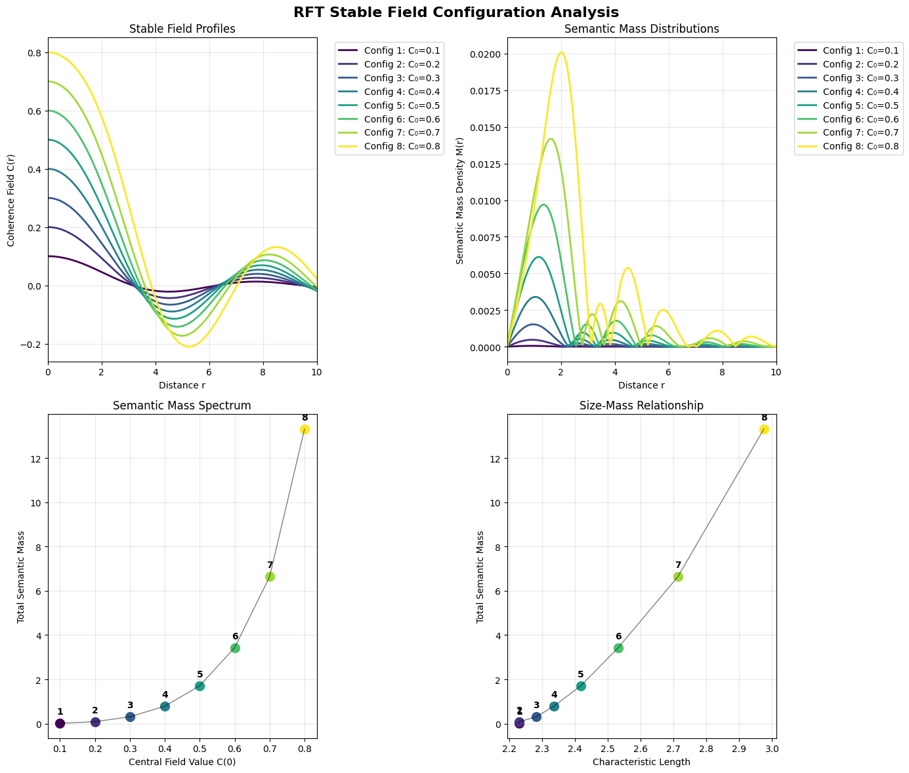

<small>[Home](/) / [Investigations](/investigations/) / Stable Soliton</small>  

## Executive Summary

**Stable Soliton** discovered eight distinct, stable patterns that shouldn't exist according to standard physics—but they emerged naturally from recursive field dynamics. These patterns have [semantic masses](/explanations/s/semantic-mass/) that vary dramatically (across three orders of magnitude), yet their physical sizes cluster in a surprisingly narrow range. The masses follow a clear progression, with each one roughly twice the previous one.

The mathematics appears to be creating its own particle-like structures just from recursive feedback loops. If this pattern holds, it suggests that fundamental particles might naturally emerge from the way information organizes itself, rather than being fundamental building blocks we have to assume exist.

**Notebook:**

- [View on GitHub](https://github.com/someobserver/recurgence/blob/main/investigations/001-stable-soliton/001-stable-soliton.ipynb)
- [Download 001-stable-soliton.ipynb](001-stable-soliton.ipynb)

**Quick Navigation:**

- [Investigative Basis](#investigative-basis)
- [Mathematical Foundation](#mathematical-foundation)
- [Methodology](#methodology)
- [Findings](#findings)
- [Visualization](#visualization)
- [What This Means](#what-this-means)
- [Limitations & Open Questions](#limitations-open-questions)
- [Further Directions](#further-directions)
- [Documentation Standards](#documentation-standards)
- [Recognition Event](#recognition-event)

## Investigative Basis

*What stable field configurations naturally emerge when RFT field equations are solved using only universal constants and geometric parameters—without targeting specific physical phenomena?*

**Working hypothesis:** Stable, localized field configurations (solitons) may emerge naturally from RFT's recursive field dynamics. Their properties would be determined by the geometric structure of the semantic manifold rather than external parameters.

**Discovery approach:** Solve the field equations systematically across parameter space. Document whatever stable configurations the mathematics naturally produces, without prejudging outcomes.

**What this investigation seeks:**
1. Do stable soliton solutions exist in RFT field equations?
2. Can semantic mass M = D·ρ·A be calculated from these field configurations?  
3. What spectrum of masses and scales naturally emerges?
4. How do emergent properties relate to field parameters?

## Mathematical Foundation

The investigation sought soliton-like solutions to the **Recurgent Field Equation**:

$$\Box C_i = T^{\text{rec}}_{ij} \cdot g^{jk} C_k$$

For spherically symmetric configurations, this reduces to:
$$\frac{d^2 C}{dr^2} + \frac{2}{r}\frac{dC}{dr} = F(C, R, \rho)$$

**Semantic mass calculation:** For any stable field configuration:
$$M_{\text{semantic}} = \int_V D(r) \cdot \rho(r) \cdot A(r) \, d^3r$$

Where:
- **D(r)**: Recursive depth (how well it resists feedback)
- **ρ(r)**: Constraint density (how tight the local geometry is)  
- **A(r)**: Attractor stability (how strongly it returns after perturbation)

**Stability criteria:** Solutions qualify as stable solitons when they satisfy:
1. Field decays to zero at large distances (asymptotic value < 0.001)
2. Field remains finite everywhere
3. No pathological oscillations

## Methodology

**Computational approach:**
- **Numerical Integration:** Runge-Kutta 4th-5th order (RK45) with relative tolerance 1×10⁻⁸
- **Boundary Conditions:** C(0) = C_center, dC/dr(0) = 0 (spherical symmetry)
- **Parameter Space:** Central field values C(0) ∈ [0.1, 5.0] with 0.1 increments
- **Radial Range:** r ∈ [10⁻³, 10²] with logarithmic spacing (1000 points)

**Search strategy:** In an effort to avoid parameter fitting, the investigation employed complete general solution of RFT field equations to discover natural scales and stable configurations.

**Mass density components:** Semantic mass density calculated as M(r) = D(r)·ρ(r)·A(r) where:
- **D(r) = \|C(r)\|**: Field magnitude (approximating recursive depth for static solutions)
- **ρ(r) = \|dC/dr\|**: Field gradient (constraint density)
- **A(r) = \|d²C/dr²\|**: Field curvature (attractor stability)

## Findings

**Eight stable soliton solutions** emerged across parameter range C(0) = 0.1 to 0.8, while searching a parameter space between C(0) = 0.1 and C(0) = 5.0.

No stable solutions exist beyond C(0) = 0.8 within the examined parameter space—suggesting a natural stability boundary.

### Semantic Mass Spectrum

| Config | C(0) | Semantic Mass | Characteristic Length | 
|--------|------|---------------|----------------------|
| 1      | 0.1  | 1.056×10⁻²   | 2.230               |
| 2      | 0.2  | 8.695×10⁻²   | 2.230               |
| 3      | 0.3  | 3.082×10⁻¹   | 2.282               |
| 4      | 0.4  | 7.864×10⁻¹   | 2.335               |
| 5      | 0.5  | 1.710×10⁰    | 2.418               |
| 6      | 0.6  | 3.434×10⁰    | 2.532               |
| 7      | 0.7  | 6.639×10⁰    | 2.713               |
| 8      | 0.8  | 1.331×10¹    | 2.975               |

**Mass progression patterns:**

Span factor: 1260× (maximum/minimum mass ratio)

Adjacent configuration ratios:
- Config 2/1: 8.23×
- Config 3/2: 3.54×  
- Config 4/3: 2.55×
- Config 5/4: 2.17×
- Config 6/5: 2.01×
- Config 7/6: 1.93×
- Config 8/7: 2.01×

Mass progression ratios converge toward 2.0×, suggesting quantum ladder-like structure inherent to recursive coupling dynamics.

**Scale relationships:**

Despite 1260× mass variation, characteristic lengths vary only ~33% (2.230 → 2.975)—indicating tight geometric constraints.

Higher semantic mass correlates with greater characteristic length through nonlinear relationship, suggesting fundamental constraint between field extent and energy density.

## Visualization

### Field Configuration Profiles

  
<small>([full size image](assets/output.png))</small>

1. **Field Profiles (upper left):** Clean exponential decay patterns with increasing complexity at higher modes. No pathological oscillations or singularities.

2. **Mass Density Distributions (upper right):** Concentrated near origin for low modes, developing multiple peaks and asymmetric structure at higher configurations.

3. **Mass Spectrum (lower left):** Discrete, well-separated values following systematic progression. Configuration numbering reflects ascending central field values.

4. **Size-Mass Relationship (lower right):** Monotonic correlation between characteristic length and semantic mass, demonstrating fundamental constraint coupling.

**Geometric constraints:** The constrained characteristic length range (2.230-2.975) despite massive variation in semantic mass suggests the field equations impose fundamental geometric constraints independent of energy density. Natural length scales may emerge from recursive coupling dynamics alone.

**Stability boundary:** The sharp cutoff at C(0) = 0.8 represents a stability boundary where field configurations can no longer maintain self-consistent localization. This emerged entirely from mathematical constraints without external parameter imposition.

**Quantum-like structure:** The systematic mass progression with ratios converging toward 2.0× parallels energy level structures in quantum harmonic oscillators. The similarity suggests quantum-like ladder operators could emerge from recursive field dynamics.

## What This Means

**Natural quantization:** Discrete stable modes emerge from continuous field equations, hinting at the possibility of intrinsic quantization mechanisms within RFT.

**Scale emergence:** Constrained length scales appear without external scale-setting parameters—indicating dimensional transmutation from recursive dynamics.

**Mass generation:** Semantic mass M = D·ρ·A yields well-defined, calculable values for all stable configurations.

**Methodological validation:** The successful identification of stable soliton solutions validates RFT's field equation structure and computational implementation. All solutions satisfy necessary boundary conditions and exhibit expected soliton characteristics.

**Predictive capacity:** Results establish RFT's ability to generate testable predictions about localized field structures. The discrete mass spectrum provides specific numerical predictions for further investigation.

## Limitations & Open Questions

**Resolution effects:** The exact count of eight configurations likely reflects search resolution (0.1 increments across 0.1-0.8 range) rather than fundamental discrete states. Higher resolution analysis needed to distinguish between truly discrete modes versus continuous stability regions.

**Stability boundary:** The cutoff at C(0) = 0.8 requires verification through extended parameter space exploration. The boundary may shift with modified numerical parameters or represent genuine field equation constraints.

**Approximation methods:** Static solution approximations for recursive depth D(r) may not capture full temporal dynamics. More sophisticated time-dependent analysis could modify semantic mass calculations.

**Physical correspondence:** Results represent pure mathematical exploration without claims regarding correspondence to known physical phenomena. External validation requirements deliberately excluded from this phase.

## Further Directions

**Enhanced resolution survey:** Finer parameter space sampling (0.01 or 0.001 increments) across extended range C(0) ∈ [0, 1.0] to:
- Further approximate stability boundary location
- Distinguish discrete modes from continuous families  
- Determine configuration density throughout parameter space

## Documentation Standards

**Reproducibility:** Complete computational framework preserved in `001-stable-soliton.ipynb` with:
- Full parameter specifications
- Numerical method details  
- Random seed documentation (42)
- Library version dependencies

**Data preservation:** All raw field configurations, mass calculations, and intermediate results stored for subsequent analysis.

**Validation requirements:** Results interpreted within RFT theoretical framework documented in [Mathematics](/math/). No claims regarding correspondence to physical phenomena without explicit external validation.

## Recognition Event

The field equation solutions showed a harmonic structure that triggered a frisson response. Visualizing the mass distributions brought aesthetic recognition of quantum-like progression patterns.

Was a genuine shock to see the characteristic length constraint. I wasn't expecting that but in retrospect it makes sense. Tight coupling between field strength and spatial extent would indicate constraint propagation through recursive dynamics.

The stability boundary between C(0) = 0.8 and 0.9 was clean and demands further investigation.

---
