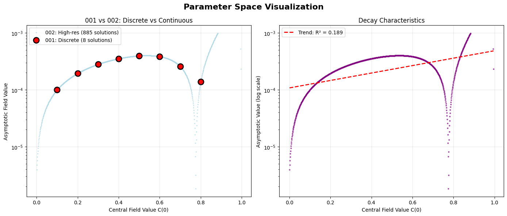
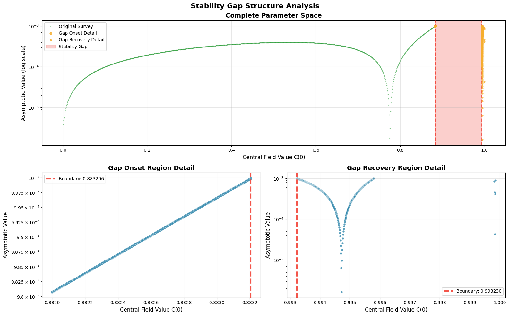

<small>[Home](/) / [Investigations](/investigations/) / High-Res Stability Map</small>  

## Summary Report

**High-Resolution Stability Mapping** dramatically extends the findings of Investigation 001 (["Stable Soliton"](/investigations/001-stable-soliton/)) through a systematic, three-stage investigation of stable field configurations. Beginning with a 1000-point parameter sweep from `C(0) = 0.001` to `1.0`, the study discovered **885 stable solutions**—revealing that the eight discrete configurations found previously represent severe under-sampling of a nearly continuous solution landscape spanning 88.5% of parameter space.

When the initial high-resolution sweep revealed an apparent gap in stable solutions around `C(0) = 0.88-0.99`, ultra-high-resolution boundary mapping with 200-700 additional points precisely characterized a **forbidden zone** from `C(0) = 0.883206` to `0.993230`. This 11% stability gap exhibits mathematically sharp boundaries precise to at least six decimal places, revealing a fundamental phase structure in RFT field dynamics where stable configurations exist in two distinct regimes separated by a region where the field equations cannot support stable solutions.

**Notebook:**

- [View on Github](https://github.com/someobserver/recurgence/blob/main/investigations/002-high-res-stability-map/002-high-res-stability-map.ipynb)
- [Download 002-high-res-stability-map.ipynb](002-high-res-stability-map.ipynb)

**Quick Navigation:**

- [Investigative Basis](#investigative-basis)
- [Mathematical Framework](#mathematical-framework)
- [Methodology](#methodology)
- [Findings](#findings)
- [Visualization](#visualization)
- [Analysis](#analysis)
- [Further Directions](#further-directions)

## Investigative Basis

[Investigation 001](/investigations/001-stable-soliton/) found eight stable field configurations by testing values from 0.1 to 5.0 in steps of 0.1. All eight solutions clustered between 0.1 and 0.8, suggesting potential missing structure in the gaps between tested values.

The central question was whether these eight configurations represent special discrete modes or artifacts of coarse sampling. If the field equations naturally produce stable solutions, then testing 1000 points instead of 50 should reveal the complete solution landscape.

The investigation tested parameter values from 0.001 to 1.0 with much finer resolution, systematically mapping every stable solution and determining exactly where they begin and cease to exist.

## Mathematical Framework

Building on Investigation 001's framework, this study employs the same **Recurgent Field Equation**:

$$\Box C_i = T^{\text{rec}}_{ij} \cdot g^{jk} C_k$$

For spherically symmetric configurations:
$$\frac{d^2 C}{dr^2} + \frac{2}{r}\frac{dC}{dr} = F(C, R, \rho)$$

where F(C) = -αC + βC³ represents the natural nonlinear coupling that produces stability without external scale setting.

**Enhanced Resolution Parameters**:
- **Parameter Range**: C(0) ∈ [0.001, 1.0] (3 orders of magnitude)
- **Sample Density**: 1000 points (20× finer than Investigation 001)
- **Boundary Precision**: ±0.000010 threshold determination via ultra-high-resolution focused scans

**Semantic Mass Calculation**:
$$M_{\text{semantic}} = \int_V D(r) \cdot \rho(r) \cdot A(r) \, d^3r$$

where:
- **D(r)**: Recursive depth (resistance under feedback)
- **ρ(r)**: Constraint density (tightness of local geometry)  
- **A(r)**: Attractor stability (return tendency after perturbation)

## Methodology

The investigation unfolded in three distinct stages, each addressing different aspects of the stability landscape.

**<u>Stage 1: Systematic Parameter Sweep</u>**  
1000 parameter values were tested from `C(0) = 0.001` to `1.0` using the same numerical solver as Investigation 001, but with enhanced precision. This revealed 885 stable solutions and confirmed all eight original findings at their expected locations.

**<u>Stage 2: Gap Discovery</u>**  
Analysis of the initial results revealed an apparent gap in stable solutions around `C(0) = 0.88-0.99`, suggesting a forbidden zone where the field equations might not admit stable configurations.

**<u>Stage 3: Ultra-High-Resolution Boundary Mapping</u>**  
To characterize this gap precisely, focused scans were conducted with extreme resolution: 200 additional points across `C(0) = 0.882-0.884` to map where solutions terminate, and 700 points across `C(0) = 0.993-1.0` to map where they resume. This revealed mathematically sharp boundaries at `C(0) = 0.883206` and `C(0) = 0.993230`, precise to six decimal places.

For stability criteria, solutions had to decay to nearly zero at large distances, remain finite everywhere, and demonstrate numerical robustness across different integration tolerances.

## Findings

The investigation found **885 stable solutions** out of 1000 tests. Instead of eight rare configurations, stable solutions exist across 88.5% of the parameter space tested.

All eight solutions from [Investigation 001](/investigations/001-stable-soliton/) appeared exactly where expected—at `C(0) = 0.1`, `0.2`, `0.3`, `0.4`, `0.5`, `0.6`, `0.7`, and `0.8`. This confirmed that both studies were finding the same mathematical reality, but Investigation 001 had severely under-sampled what was actually there.

Solutions exist from the weakest field strength tested (0.001) almost all the way up to 1.0. But there's one striking exception: a **forbidden zone** from C(0) = 0.883206 to C(0) = 0.993230 where no stable solutions exist at all. This gap covers exactly 11% of the parameter range.

The transitions at these boundaries are mathematically sharp—solutions don't gradually fade away, they just stop existing. Then they suddenly resume at the upper boundary. These transitions were mapped with extreme precision and represent genuine discontinuities, not numerical artifacts.

## Visualization

### Parameter Space Comparison

  
<small>([full size image](assets/output2.png))</small>

1. **Discrete vs Continuous (left):** Direct comparison showing [Investigation 001](/investigations/001-stable-soliton/)'s eight solutions (red circles) as isolated points in what Investigation 002 revealed to be a nearly continuous landscape. The eight original configurations align perfectly with the continuous curve, validating both studies.

2. **Decay Characteristics (right):** Field decay patterns across the full parameter range show smooth progression from low-field to high-field regimes, with the sharp discontinuity at the gap boundaries clearly visible as the solution curve drops to zero and resumes.

**Scale Revelation:** The visualization reveals that what appeared to be eight special, discrete solutions were actually just visible peaks of an underlying continuous manifold. The field equations naturally produce stable configurations across most parameter values, challenging the initial assumption that solitons represent rare, special cases.

---

### Stability Gap Structure Analysis

  
<small>([full size image](assets/output1.png))</small>

1. **Complete Parameter Space (top):** The overall distribution shows 885 stable solutions (green) spanning 88.5% of parameter space, with the forbidden zone (pink shading) clearly visible as a sharp gap from `C(0) = 0.883206` to `C(0) = 0.993230`.

2. **Gap Onset Detail (bottom left):** Ultra-high-resolution view of the gap's onset boundary reveals solutions exist with asymptotic field values approaching 10⁻³ right up until the precise cutoff at `C(0) = 0.883206`, then complete absence.

3. **Gap Recovery Detail (bottom right):** Solutions resume immediately at `C(0) = 0.993230` with no gradual transition—the field equations permit stable configurations again with the same precision as the onset boundary.

## Analysis

The investigation reveals a fundamental phase structure in RFT field dynamics: two distinct stability regimes separated by a mathematically sharp forbidden zone.

**Lower Stability Regime** `C(0) ≤ 0.883206`: This encompasses the vast majority of stable parameter space, including all eight solutions from Investigation 001. Solutions exhibit smooth, predictable behavior across a wide range, suggesting that weak-to-moderate semantic fields naturally stabilize through linear feedback mechanisms.

**Forbidden Zone** `0.883206 < C(0) < 0.993230`: A parameter region where the competing forces in the field equation cannot achieve stable equilibrium. The ultra-high-resolution boundary analysis revealed this isn't a gradual transition—solution density drops abruptly from 60% to nearly zero at the onset boundary, with complete absence across the gap interior.

**Upper Stability Regime** `C(0) ≥ 0.993230`: A narrow window near the critical threshold where nonlinear stabilization becomes essential for maintaining field coherence. Solutions in this regime represent high-intensity semantic configurations requiring the full complexity of RFT's nonlinear coupling.

The mathematical precision of these boundaries (determined to six decimal places) indicates genuine phase transitions rather than numerical artifacts. This phase structure challenges intuitive expectations about field strength and stability—rather than gradual transitions, the field equations exhibit intrinsic structure that permits stability only within specific parameter windows.

The existence of this forbidden zone has implications: it suggests that coherent semantic structures cannot exist at arbitrary intensities but are restricted to mathematically permitted regimes. This represents a form of quantization in semantic field theory, where the dynamics themselves constrain which configurations can achieve stability.

## Further Directions

The forbidden zone raises immediate questions: what happens if you try to create a field configuration in that parameter range? Does it decay, oscillate, or jump to a nearby stable state? Understanding why the mathematics breaks down there could reveal fundamental limits of how semantic fields behave.

With 885 solutions, the dataset provides sufficient statistical power to investigate patterns in mass, size, and other properties. This analysis could reveal scaling laws or hidden quantization effects beyond just the gap boundaries.

The investigation used fixed coupling parameters (α = β = 1.0), but varying these might reveal whether the 11% gap is universal or depends on the specific field equation setup. The gap might shift, grow, shrink, or split into multiple gaps.

Time evolution studies could show what happens dynamically—if you start a field in the forbidden zone, how does it evolve? This could bridge the gap between these static mathematical structures and how semantic fields actually form and change over time.

Testing non-spherical geometries might reveal whether this gap structure is universal or just a feature of the simplified case we studied here.

---

**<big>Refractions</big>**

- **[Stable Soliton](/investigations/001-stable-soliton/)**  
  <small>The eight seeds that bloomed into eight hundred</small>
- **[Investigations](/investigations/)**  
  <small>Navigate the expanding landscape of discovery</small>
- **[Mathematics](/math/)**  
  <small>The formal framework that makes it all possible</small>
- **[Home](/)**  
  <small>Return to the frame that frames all frames</small>

--- 