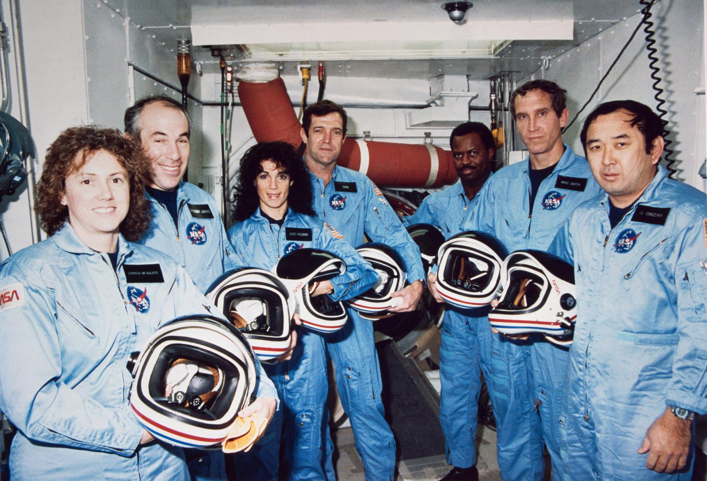

<small>[Home](/) / [Pathologies](/pathologies/) / [Rigidity](/pathologies/rigidity/) / Belief Calcification</small>

---

The system receives feedback, acknowledges it, and even understands it intellectually, but has lost the capacity to convert meaningful information into adaptive change. That's Belief Calcification.

It involves systems that *want* to change and know they *should* change, but can't bridge the gap from understanding to action. Analysis paralysis at every scale—from individuals who endlessly research the perfect diet without ever changing what they eat, to institutions that commission report after report without implementing a single recommendation.

This functions as executive dysfunction, quantified.

## Math Translation

The signature of Belief Calcification is a fundamental responsiveness failure:

$$
\lim_{\epsilon \to 0} \frac{dC}{dt}\bigg|_{C+\epsilon} \approx 0
$$

**Translation:** Even when the system gets new feedback, changing conditions, or updated information, the rate of actual change approaches zero. The system's capacity to respond and adapt has essentially gone offline.

This breaks the most basic function of any adaptive system: turning information into action. The sensors work fine, the data gets processed, but the bridge from "we understand the problem" to "we're actually doing something about it" has calcified.

## Recognition Patterns

### [ Individual Scale ]

You've internalized "nothing I do matters" so completely that even when you gain new power or agency, you can't process the signals indicating you could actually influence your situation now. Past conditioning creates complete inability to recognize when circumstances have genuinely changed—the textbook case of learned helplessness.

Analysis paralysis develops around anything requiring sustained behavior change. You research productivity systems endlessly, but never get around to implementing one. You know exactly what kind of exercise routine would work for your body and your schedule, understand the principles of nutrition, even buy the right equipment and the Lululemon leggings. But somehow you never turn all that knowledge into consistent practice.

Trauma responses lock the nervous system in threat-detection mode even when environmental feedback clearly signals safety. Your rational mind processes that the relationship is healthy, the job is secure, the neighborhood is safe, but your body can't update its operational assumptions about the world.

### [ Cultural Scale ]

Educational institutions accumulate decades of research on active learning, student engagement, and different learning styles, but classrooms still operate like information-transmission factories from the industrial age. Teachers know lecture-based learning is suboptimal, and administrators cite research on project-based education. Yet the fundamental structure persists unchanged.

News consumption and doomscrolling persist despite widespread awareness of their psychological damage. Everyone knows endless exposure to negative information increases anxiety, disrupts sleep, and degrades mental health. Research confirms that limiting news intake improves well-being. People understand this intellectually, many even try digital detoxes or set app limits. But culturally, we keep refreshing feeds compulsively, checking for updates that rarely contain actionable information. We collectively can't turn awareness about healthy information habits into actual behavior change.

### [ Institutional Scale ]

Companies invest heavily in surveys, focus groups, and market research, but products somehow never reflect what customers actually want. The feedback gets collected, analyzed, even presented to leadership, but organizations can't bridge the gap from insight to implementation.

Corporate meeting culture exemplifies calcification. Calendar Tetris eliminates deep work, meeting fatigue degrades decision quality, and everyone's favorite recursive trap: "let's meet to discuss why we have so many meetings." Teams conduct retrospectives identifying the same collaboration overhead quarter after quarter. Leadership sponsors initiatives to address the problems, but the structural patterns persist, a pattern of their own.

Healthcare systems possess extensive evidence about preventive care, social determinants of health, and patient-centered medicine, but remain structurally incentivized into reactive, crisis-driven models.

Academic institutions commission report after report on student mental health and campus culture. Somehow, the recommendations get filed away while the same problems persist semester in, semester out.

## Case Studies

### [ Historical ]

#### Challenger Disaster - 28 Jan 1986

Engineers had clear data showing O-ring failure risks in cold weather. They raised concerns repeatedly through the proper channels. The information was acknowledged and understood by leadership. But NASA's organizational system had grown so calcified, it couldn't (or wouldn't) process the feedback into stopping the launch. Executive (dys)function that should have converted engineer warnings into astronaut safety failed an entire nation, costing the lives of seven incredible people.

In memory of (left to right): Payload Specialist and first-teacher-in-space **Christa McAuliffe**, Payload Specialist **Gregory Jarvis**, Mission Specialist **Judith Resnik**, Commander **Dick Scobee**, Mission Specialist **Ronald McNair**, Pilot **Michael Smith**, and Mission Specialist **Ellison Onizuka** (NASA Photo).

#### BP Deepwater Horizon - 20 April 2010

BP had extensive safety data showing risks with the Macondo well. Equipment failures, cement problems, and their own risky cost-cutting—they had ample warning. Engineers understood the dangers intellectually, and safety protocols existed on paper. But the organization couldn't turn those warnings into safer practices. This breakdown ultimately cost eleven lives and created the second worst oil spill in history.

In memory of: **Shane Roshto** (22), **Adam Weise** (24), **Roy Wyatt Kemp** (27), **Gordon Jones** (28), **Jason Anderson** (35), **Bubba Burkeen** (37), **Karl Kleppinger Jr.** (38), **Stephen Ray Curtis** (40), **Dewey Revette** (48), **Donald Clark** (49), and **Keith Manuel** (56).

### [ Media ]

#### Don't Look Up

The comet is coming in six months and will end all life on Earth. The scientists have peer-reviewed data, the trajectory calculations are irrefutable, and eventually even the media acknowledges the threat. World leaders hold summits, make speeches, and draft action plans. But somehow the collective executive function of human civilization cannot convert "we all know we're going to die" into stopping the comet. The irony comes in hot: endlessly scheduling meetings about a comet approaching right on schedule.

#### WALL-E

Captain McCrea *knows* the ship should return to Earth, *understands* that centuries of automation have made humans helpless, and *genuinely wants* to take control of his own vessel. But when he tries to initiate the return sequence, he literally has to wrestle the ship's steering wheel away from AUTO. The ship's executive function has calcified around keeping humans passive. It cannot convert the captain's direct orders into action without a physical fight.

#### Groundhog Day

Phil Connors has unlimited time to study Rita. He learns her favorite poetry and ice cream flavors, understands exactly what kind of man she's attracted to. He knows being authentic and selfless will win her over more than any manipulation. But loop after recursive loop, he keeps trying to game the system instead of actually being genuine. Only after repeated failures teach him humility does he finally turn self-knowledge into authentic change. He escapes the loop when he learns *how* to stop trying to escape it.

<small>[Home](/) / [Pathologies](/pathologies/) / [Rigidity](/pathologies/rigidity/) / Belief Calcification</small>

---